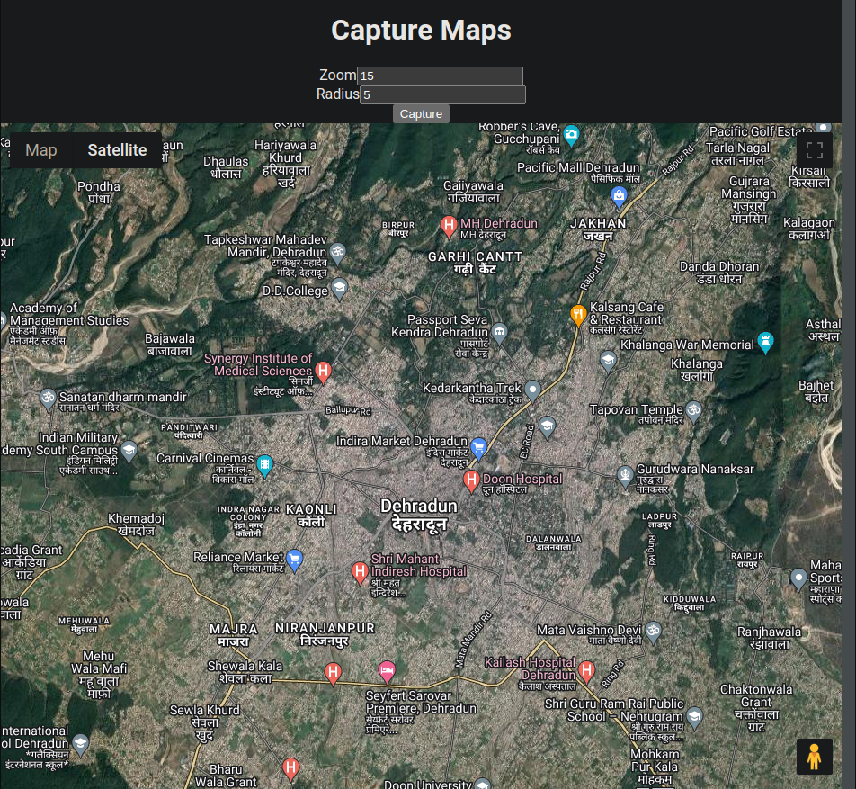

# Capture Maps UI

Front end for [Capture Maps API](https://github.com/zxcV32/capture-maps-api) to download detailed
Maps (Google Maps)

**Try out [maps.zxcv32.com](https://maps.zxcv32.com/)**

# Setup
1. Create `.env` in the project root and store Google Maps Static API|

   `cp .env.template .env`
2. Run project
   
   ```bash
   npm install
   npm start
   ```
## Docker

`docker build -t ghcr.io/zxcv32/capture-maps-ui:main --build-arg GOOGLE_MAPS_API_KEY='<API_KEY>' --build-arg API_HOST='<host>' .`
`docker compose up -d`




## Feature List

| Status | Feature                                       | 
|--------|-----------------------------------------------|
| [x]    | map to image                                  |
| [ ]    | map to printable pdf                          |
| [ ]    | Dynamic radius on zoom in/out (or hide field) |
| [ ]    | map to overlapping roads, satellite, terrain  |
| [ ]    | Draw/Select region to print                   |
| [ ]    | Payment calculator                            |
| [ ]    | Payment processor                             |
| [ ]    | OpenStreetMap integration                     |


